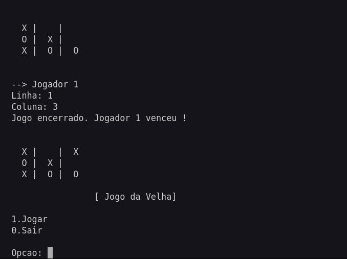

# Jogo da Velha em C

Este projeto implementa a lógica de um jogo da velha (tic-tac-toe) utilizando a linguagem C. O objetivo é permitir que dois jogadores se enfrentem, marcando seus símbolos (`X` ou `O`) em um tabuleiro 3x3 até que um deles vença ou o jogo termine em empate.



## Funcionalidades

- **Tabuleiro 3x3:** O jogo utiliza uma matriz 3x3 para representar o tabuleiro.
- **Controle de Jogadores:** O primeiro jogador marca com `X` (representado pelo número `1`), e o segundo jogador marca com `O` (representado pelo número `-1`).
- **Detecção de Vitória e Empate:** O jogo termina quando uma linha, coluna ou diagonal é completada por `X` ou `O`, ou quando todas as casas estão preenchidas sem um vencedor, resultando em empate.
- **Menu Interativo:** Permite ao jogador escolher entre iniciar uma nova partida ou sair do jogo.

## Estrutura do Programa

### Função `main()`
- Cria o tabuleiro e controla o fluxo do jogo.
- Utiliza um laço `while` para manter o jogo em execução até que o jogador decida sair.
- Chama a função `menu()` para exibir as opções de jogo.

### Função `menu()`
- Exibe as opções de `Jogar` ou `Sair`.
- Retorna a escolha do jogador para a função `main()`.

### Função `jogar()`
- Inicializa o tabuleiro e gerencia o loop principal do jogo.
- Chama a função `zeraTabuleiro()` para limpar o tabuleiro antes do início de cada partida.
- Utiliza a função `exibeTabuleiro()` para mostrar o estado atual do tabuleiro.
- Chama a função `jogada()` para registrar a jogada do jogador atual.
- Verifica o término do jogo com a função `checaTermino()`.

### Função `zeraTabuleiro()`
- Zera todas as posições do tabuleiro, garantindo que não haja resíduos de jogos anteriores.

### Função `exibeTabuleiro()`
- Exibe o tabuleiro na tela, substituindo os números 0, 1 e -1 por espaços vazios, `X` e `O`, respectivamente.

### Função `jogada()`
- Solicita ao jogador a linha e a coluna onde deseja marcar.
- Verifica se a posição escolhida está vazia e se os valores são válidos.
- Marca a posição no tabuleiro de acordo com o jogador da vez.

### Função `checaTermino()`
- Verifica se o jogo terminou, chamando funções auxiliares:
  - `checaLinha()`: Verifica se alguma linha foi completada.
  - `checaColuna()`: Verifica se alguma coluna foi completada.
  - `checaDiagonal()`: Verifica se alguma diagonal foi completada.
  - `checaEmpate()`: Verifica se todas as casas estão preenchidas, resultando em empate.

## Como Executar

1. Compile o programa com um compilador C, como o `gcc`:
   ```bash
   gcc -o jogo_da_velha jogo_da_velha.c

2. Execute o programa:
3. Siga as instruções no terminal para jogar.

### Melhorias Futuras

- Implementar um modo de jogo contra a máquina (IA).
- Permitir que os jogadores escolham seus símbolos (X ou O).
- Implementar uma interface gráfica para o jogo.

### Contribuições
Contribuições são bem-vindas! Sinta-se à vontade para abrir uma issue ou enviar um pull request com melhorias ou correções.

